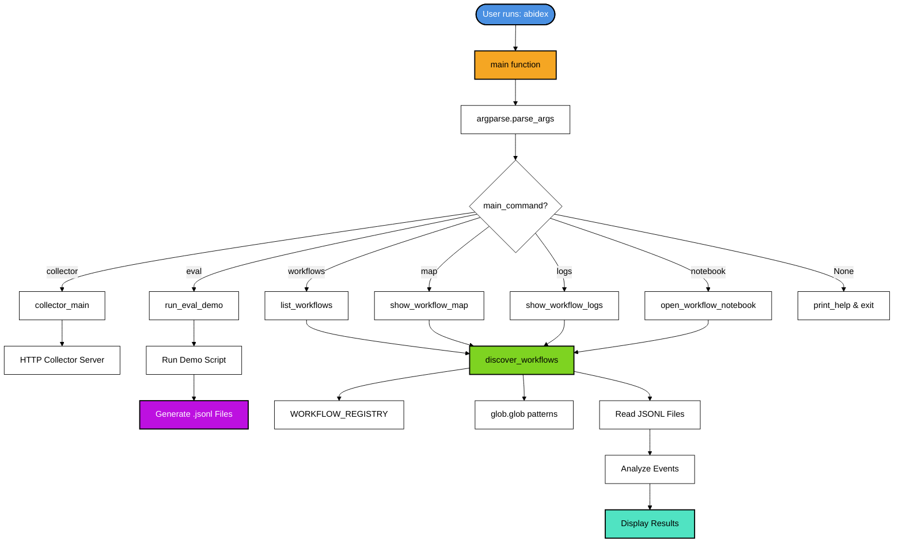
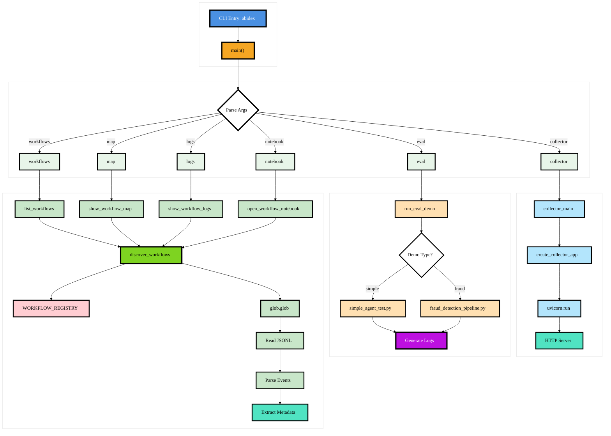
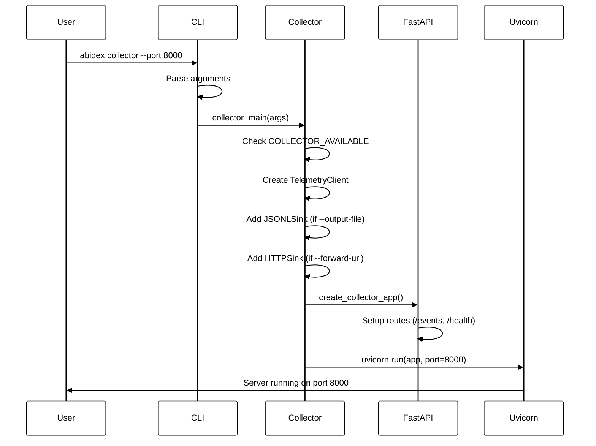
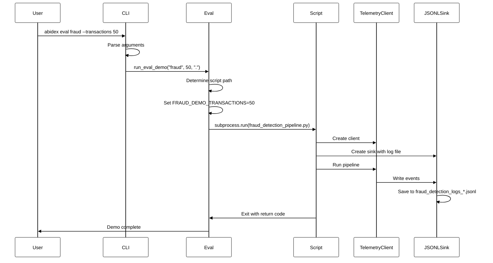
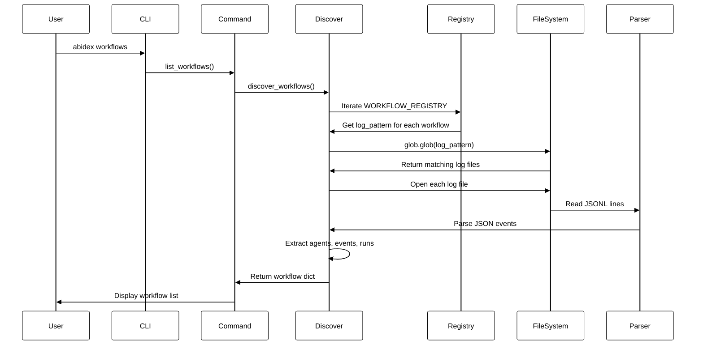
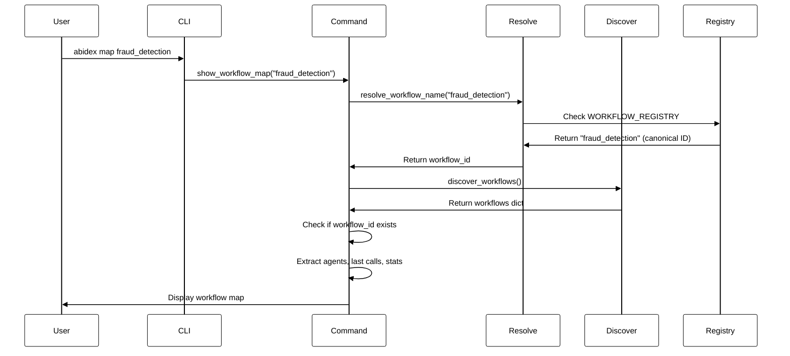
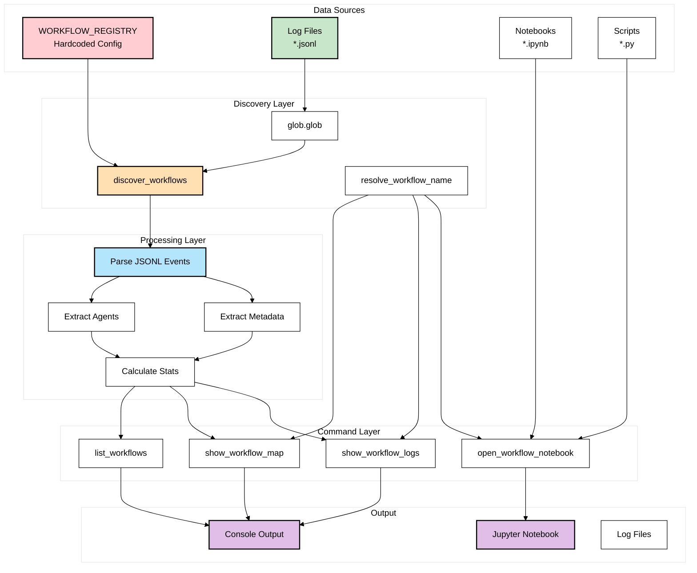
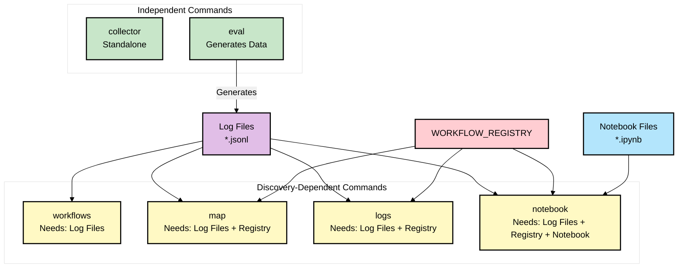
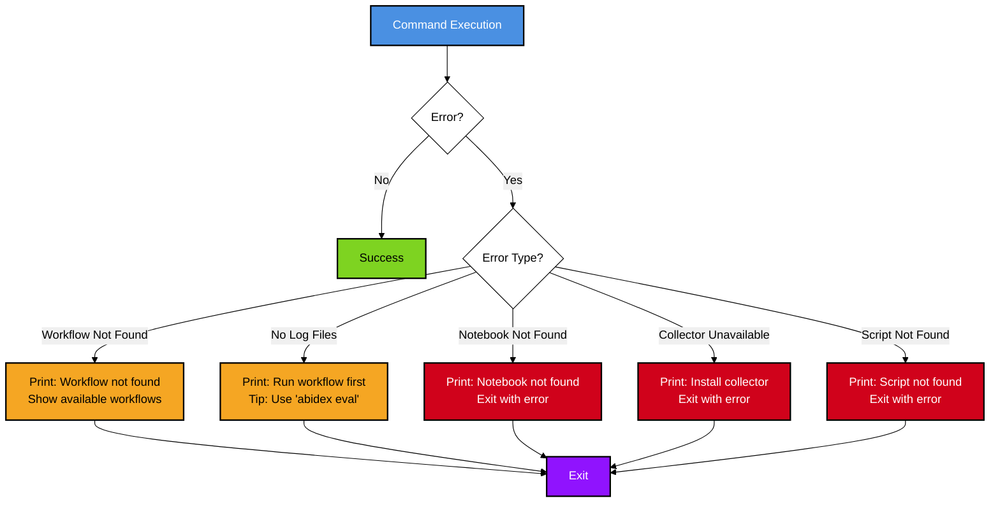

# AbideX CLI Architecture Diagram

## Overview

This document describes the architecture of the AbideX CLI, showing how commands are structured, routed, and how they interact with each other.

---

## High-Level Architecture



---

## Command Flow Diagram



---

## Detailed Command Flow

### 1. Collector Command Flow



### 2. Eval Command Flow



### 3. Workflow Discovery Flow



### 4. Map/Logs/Notebook Command Flow



---

## Data Flow Diagram



---

## Command Dependencies



---

## Function Call Hierarchy

```
main()
├── argparse.ArgumentParser()
│   ├── add_subparsers() → Creates command structure
│   ├── collector_parser → Collector arguments
│   ├── eval_parser → Eval arguments
│   ├── workflows_parser → No arguments
│   ├── map_parser → Workflow name argument
│   ├── logs_parser → Workflow name argument
│   └── notebook_parser → Workflow name + port
│
├── parser.parse_args()
│
└── Route by main_command:
    │
    ├── "collector" → collector_main(args)
    │   ├── Check COLLECTOR_AVAILABLE
    │   ├── Create TelemetryClient
    │   ├── Add sinks (JSONLSink, HTTPSink)
    │   ├── create_collector_app()
    │   └── uvicorn.run()
    │
    ├── "eval" → run_eval_demo(demo, transactions, output_dir)
    │   ├── Determine script path
    │   ├── Set environment variables
    │   └── subprocess.run(script)
    │
    ├── "workflows" → list_workflows()
    │   └── discover_workflows()
    │       ├── Iterate WORKFLOW_REGISTRY
    │       ├── glob.glob(log_pattern)
    │       ├── Read JSONL files
    │       ├── Parse events
    │       └── Extract metadata
    │
    ├── "map" → show_workflow_map(workflow)
    │   ├── resolve_workflow_name(workflow)
    │   └── discover_workflows()
    │
    ├── "logs" → show_workflow_logs(workflow)
    │   ├── resolve_workflow_name(workflow)
    │   ├── Get config from WORKFLOW_REGISTRY
    │   └── glob.glob(log_pattern)
    │
    └── "notebook" → open_workflow_notebook(workflow, port)
        ├── resolve_workflow_name(workflow)
        ├── Get config from WORKFLOW_REGISTRY
        ├── Check notebook exists
        └── subprocess.run(jupyter notebook)
```

---

## Key Components

### 1. **Entry Point** (`main()`)
- Creates argument parser with subcommands
- Routes to appropriate handler based on `main_command`
- Handles help and error cases

### 2. **Workflow Registry** (`WORKFLOW_REGISTRY`)
- Hardcoded dictionary mapping workflow IDs to configurations
- Contains: display_name, log_pattern, notebook, script, aliases
- Used by all workflow-related commands

### 3. **Discovery System** (`discover_workflows()`)
- Core function used by multiple commands
- Reads WORKFLOW_REGISTRY
- Scans filesystem for log files matching patterns
- Parses JSONL files to extract metadata
- Returns enriched workflow information

### 4. **Workflow Resolution** (`resolve_workflow_name()`)
- Converts user input (name or alias) to canonical workflow ID
- Checks direct matches and aliases
- Used by map, logs, and notebook commands

### 5. **Command Handlers**
- **collector_main()**: Sets up HTTP collector server
- **run_eval_demo()**: Executes demo scripts
- **list_workflows()**: Lists discovered workflows
- **show_workflow_map()**: Shows workflow agent map
- **show_workflow_logs()**: Shows log file information
- **open_workflow_notebook()**: Launches Jupyter notebook

---

## Typical User Workflows

### Workflow 1: Running a Demo and Analyzing

```
1. User: abidex eval fraud --transactions 50
   → Generates: fraud_detection_logs_*.jsonl

2. User: abidex workflows
   → Discovers and lists workflows including "fraud_detection"

3. User: abidex map fraud_detection
   → Shows agents and their last calls

4. User: abidex notebook fraud_detection
   → Opens Jupyter notebook for analysis
```

### Workflow 2: Starting Collector

```
1. User: abidex collector --port 8000 --output-file telemetry.jsonl
   → Starts HTTP server on port 8000
   → Saves events to telemetry.jsonl
   → Runs until interrupted
```

### Workflow 3: Exploring Existing Logs

```
1. User: abidex workflows
   → Lists all discovered workflows

2. User: abidex logs weather
   → Shows log files for weather workflow

3. User: abidex map weather
   → Shows detailed workflow map
```

---

## Dependencies Between Commands

| Command | Requires | Generates | Used By |
|---------|----------|-----------|---------|
| `eval` | Demo scripts | Log files | `workflows`, `map`, `logs`, `notebook` |
| `workflows` | Log files, Registry | Workflow list | User (discovery) |
| `map` | Log files, Registry | Workflow map | User (analysis) |
| `logs` | Log files, Registry | Log info | User (inspection) |
| `notebook` | Log files, Registry, Notebooks | Jupyter server | User (analysis) |
| `collector` | FastAPI, uvicorn | HTTP server | External agents |

---

## File System Interactions

```
Project Root/
├── abidex/
│   ├── cli.py (main entry point)
│   ├── client.py
│   └── ...
├── simple_agent_test.py (demo script)
├── fraud_detection_pipeline.py (demo script)
├── simple_agent_logs_*.jsonl (generated logs)
├── fraud_detection_logs_*.jsonl (generated logs)
├── agent_logs_analysis.ipynb (notebook)
└── fraud_detection_analysis.ipynb (notebook)
```

---

## Error Handling Flow



---

## Configuration Points

### Hardcoded (Current)
- `WORKFLOW_REGISTRY`: Workflow definitions
- Log file patterns: `"*_logs*.jsonl"`
- Default ports: `8000` (collector), `8888` (notebook)
- Script paths: `simple_agent_test.py`, `fraud_detection_pipeline.py`
- Notebook paths: `agent_logs_analysis.ipynb`, `fraud_detection_analysis.ipynb`

### Configurable (Future)
- Workflow registry via config file
- Log file patterns via environment/config
- Ports via environment variables
- Script/notebook discovery via patterns

---

## Performance Considerations

1. **Discovery Caching**: `discover_workflows()` reads all log files each time
   - **Impact**: Slow for large log files
   - **Solution**: Implement caching or sampling

2. **File I/O**: Multiple commands read the same log files
   - **Impact**: Redundant file reads
   - **Solution**: Cache parsed results

3. **Pattern Matching**: `glob.glob()` called multiple times
   - **Impact**: Filesystem queries
   - **Solution**: Cache glob results

---

## Extension Points

### Adding New Commands

1. Add subparser in `main()`
2. Add routing in `main()` command handler
3. Implement command function
4. Update help text

### Adding New Workflows

1. Add entry to `WORKFLOW_REGISTRY` (current)
2. Or implement auto-discovery (future)

### Customizing Discovery

1. Modify `discover_workflows()` logic
2. Add new metadata extraction
3. Support custom patterns

